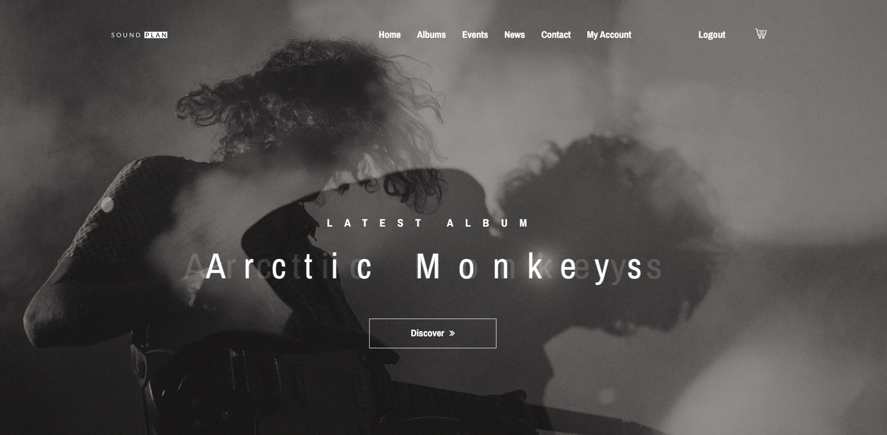
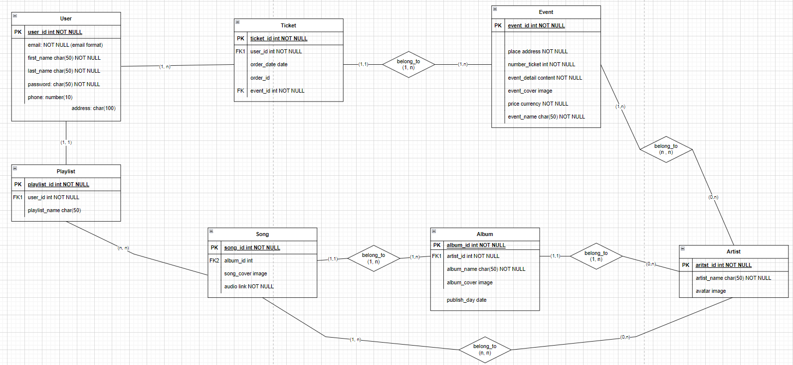

# Sound-Plan

This is my Music Player web-app using Django frame-work.

Final project for the Python programmer course at HCMUS-CSC center.

Templates Copyright © All rights reserved by Colorlib.

The song data is crawled from Spotify and Google Play Music by [spotdl](https://github.com/spotDL/spotify-downloader) tool.

The models (data base design) in Entity Relationship Diagram:

This is a personal project that is solely approved for educational purposes.

Use with caution; the author disclaims any liability for users misuse.
